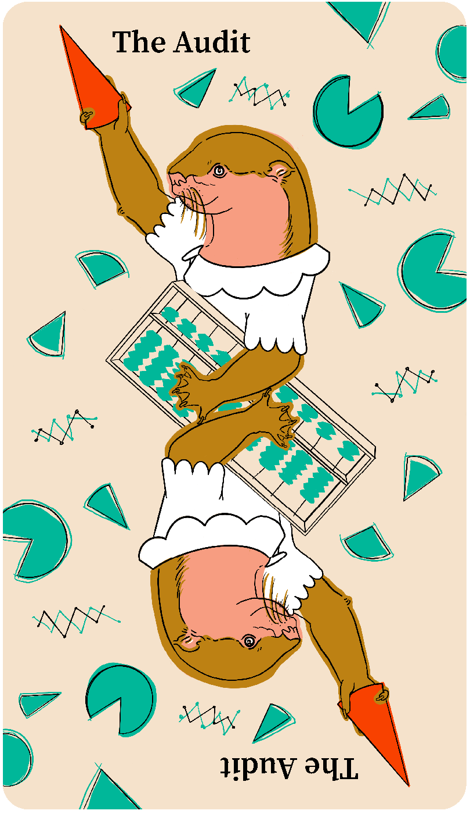

# The Audit

This project type focuses on accounting for the docs you already have, to help you make decisions about what to delete, modify, create, or reorganize.

_The Audit_ is also known as an inventory or review.

_The Audit_ is often preceded by [The Study](./study.md), to help you learn what your audience needs from your documentation.

_The Audit_ is sometimes difficult to estimate for size or duration.
Consider testing the work with [The Prototype](./prototype.md).

_The Audit_ is often followed by any of the other project types.
 
 
 
 
 

## Audience

This type of project benefits:

<table>
  <thead>
    <tr>
      <th>Audience</th>
      <th>Frequency</th>
    </tr>
  </thead>
  <tbody>
    <tr>
      <td>Users of your software</td>
      <td>Rarely</td>
    </tr>
    <tr>
      <td>Third-party developers and administrators</td>
      <td>Rarely</td>
    </tr>
    <tr>
      <td>Contributors to your software and docs</td>
      <td>Always</td>
    </tr>
  </tbody>
</table>

## When to do this project

Do this project when you have existing documentation that is in an unknown condition, especially with respect to maintenance, quality, accessibility, and findability.

Do this project to solve problems such as:

- You don’t know what documentation you have.
  For example, you have recently taken over maintenance of an open source project with little or no handoff from the previous maintainers.

- You have docs in many different locations, formats, or styles.
  For example, you have documentation that’s published in many separate places, such as a website, a README, man pages, and a maintainer’s personal blog.

- You have docs that are unmanaged.
  For example, your docs are published in a free-for-all wiki or a chat forum.

- You have many untriaged or unreviewed documentation issues, bug reports, pull requests, or patches.
  For example, your repository has many draft pull requests for documentation.

- You know you have problems of a specific kind but you don’t know the scope and severity of those problems.
  For example, users have reported accessibility problems, but you don’t know how many articles are affected.

Don’t do this project when you have very little documentation to audit, such as a single, brief README file.

## Tasks and deliverables

You have finished this type of project when you’ve completed tasks such as:

- Choosing what to inventory and audit
- Preparing an inventory spreadsheet or database
- Finding locations of existing documentation
- Processing docs into the inventory
- Analyzing the results
- Making recommendations
- Preparing summaries and reports
- Presenting results to stakeholders

You probably won’t do all of these steps.
Choose the ones that make the most sense for your goals, available skills and resources, and timeline.

### Out of Scope

Some tasks aren’t part of this project type, such as writing or editing docs based on the results.

Avoid including this work in _The Audit_.
Break it out into its own project.

## Key people

Technical writers, content strategists and project or product managers often do this work.

Many experts include targeted inventories and audits as part of their practice.
For example, accessibility experts often begin their work with an accessibility audit.
Sometimes it’s helpful to work with someone who you expect to be involved in follow-up work, to minimize knowledge transfer costs.

Good candidates for this work often have experience with content inventories, content audits, or audits for a specific issue (for example, accessibility).
That said, inventories and audits are a good way for a new contributor to gain project knowledge quickly, so experience may not be a barrier, depending on your needs.

A good fit for this work feels at home in a spreadsheet and is not afraid to trade tedium for knowledge.

Others contribute to this work.
In your plan, don’t forget to include:

- Team leadership
- Code and docs reviewers
- Support roles, such as community managers, foundation leaders, and fiscal and other sponsors (and sponsor staff, such as finance, recruiters, sysadmins, or legal)

## Delay and failure risks

This project type is at most risk from scope creep.
Other sources of risk are less common.

Risks include:

- Scope creep.
  While reviewing existing docs, it’s tempting to stop and fix problems as they are encountered.
  Resist the urge, since it’s very likely to delay completion of the project in general.
  Besides, a problem’s frequency is valuable information to share with other contributors; don’t bury it.

- Absolute scale and difficulty.
  This work is labor intensive.
  If an audit covers a large documentation set or records a lot of detailed information, then a single auditor may take a long time to complete the project.
  If the work is very large, consider testing the process on a random sample first ([The Prototype](./prototype.md)), then divide the work on meaningful subsets between multiple contributors.

- Key people become unavailable.
  Comprehensive audits are especially vulnerable to unexpected departures.
  Documenting the process or sharing the work amongst multiple contributors provide some protection against outright failure, at the cost of increased risk of delay.

## Resources

- [Documentation maturity audit (google/opendocs)](https://github.com/google/opendocs/blob/main/audit/README.md)
- [The Elements of Content Strategy](https://elements-of-content-strategy.abookapart.com/) by Erin Kissane
- [How to Make Sense of Any Mess](https://www.howtomakesenseofanymess.com/) and [The Sensemaker’s Guide to Auditing](https://abbycovert.com/writing/guide-to-auditing/) by Abby Covert
- Related project: [Google Season of Docs Case Study - matplotlib](https://docs.google.com/document/d/1UxuvoPUh9CPyxyc_bxJ398di-WJJNB7mJQMVrhPD6_E/edit?tab=t.0)
