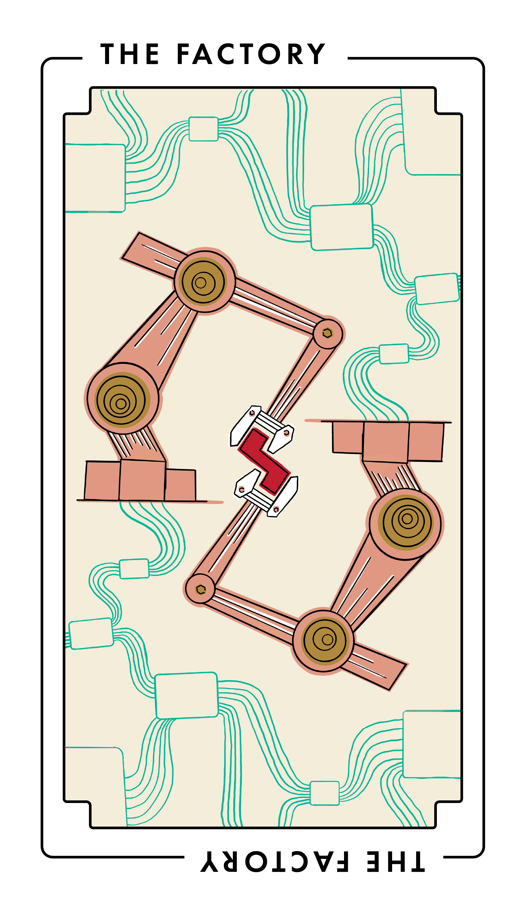

# The Factory

This project type focuses on automation for your docs, to help your docs contributors make docs more quickly, with less effort, or to a higher standard of quality.

_The Factory_ is also known as docs generation, continuous delivery, and continuous integration.
You can recognize it by some of its tools and methods, such as spell check, grammar check, style check, link checkers, linters, formatters, automated testing, and readability scoring.

_The Factory_ is most closely related to [The Rules](./rules.md), which might describe how documentation is meant to be produced for your software project, and [The Migration](./migration.md), which also adopts new tools but doesn’t generally produce new docs.

_The Factory_ is sometimes difficult to estimate for size or duration.
Consider testing the work with [The Prototype](./prototype.md).

_The Factory_ is often preceded by:

- [The Rules](./rules.md), to define expectations for docs or document processes that are candidates for automation
- [The Audit](./audit.md), to determine what docs already exist or are already generated
- [The Migration](./migration.md), to adopt tools to facilitate automation

_The Factory_ is often followed by [The Edit](./edit.md), to apply fixes to problems identified by new automation.

## Audience

This type of project benefits:

<table>
  <thead>
    <tr>
      <th>Audience</th>
      <th>Frequency</th>
    </tr>
  </thead>
  <tbody>
    <tr>
      <td>Users of your software</td>
      <td>Sometimes</td>
    </tr>
    <tr>
      <td>Third-party developers and administrators</td>
      <td>Sometimes</td>
    </tr>
    <tr>
      <td>Contributors to your software and docs</td>
      <td>Sometimes</td>
    </tr>
  </tbody>
</table>

## When to do this project type

Do this type of project when you have rote documentation tasks to complete and you wish to free human contributors to work on more cerebral tasks.

Do this project to solve problems such as:

- Handwritten docs production is especially costly or error prone.
  For example, common style errors pass by undetected by reviewers or authors spend a lot of time duplicating information that exists in code.

- Quality improvement work backslides when solved problems are reintroduced into your documentation.
  For example, typos in existing docs get fixed only to be made again in new docs.

- You have structured data that might answer some user needs, but there’s no published form that humans can read.
  For example, you have a machine-readable data schema but no corresponding schema docs.

Don’t do this project when:

- You (or a vocal documentation contributor) wants to install their favorite tool.
  Some people only have a hammer; don’t let your docs be the nail.

- Your documentation (or supporting data sources) are especially unstructured (see [The Edit](./edit.md) or [The Manual](./manual.md) instead).

- Your documentation set is especially small, complete, or changes infrequently.

## Tasks and deliverables

You have finished this type of project when you’ve completed tasks such as:

- Audience analysis, such as finding out who’s going to read the documentation (users of your software), what motivates them, the things they already know about, and what they might need to learn (sometimes as a project of its own, [The Study](./study.md))
- User research, such as finding out who’s going to use the new documentation tools, what their needs are, their strengths, weaknesses, and expectations
- Technology research, such as finding possible tools or formats, evaluating them, and making recommendations to decisionmakers and stakeholders
- Writing code or configuration files
- Generating, reviewing, and revising draft docs
- Resolving content errors identified by the new tools, such as fixing broken links, typos, or style violations
- Onboarding documentation contributors to the new tools, through promotion, training, or docs (sometimes as a project of its own, [The Rules](./rules.md))

You probably won’t do all of these steps.
Choose the ones that make the most sense for your goals, available skills and resources, and timeline.

### Out of scope

Some tasks aren’t part of this project type, such as:

- Using templates to help humans write documentation ([The Manual](./manual.md))
- Choosing a style guide or codifying a manual process to be automated ([The Rules](./rules.md))

Sometimes existing tools might not support compelling automation.
For example, if your docs are hosted in a proprietary discussion forum, then it might not be practical (or permitted) to automate docs production.
Consider [The Migration](./migration.md) instead.

## Key people

A technical writer or documentation engineer often does this work.

Good candidates for this work often have:

- Experience with change management.
  It’s likely that your documentation process will be different after the automation work is complete.
  Documentation contributors need help understanding the change, accepting it, and using the new tools.

- Experience with your current and target docs tooling.
  For example, look for a practitioner of [docs as code](https://www.writethedocs.org/guide/docs-as-code/).

A good fit for this work will start with research questions: what is actually time-consuming and what is genuinely automatable?

Others contribute to this work.
In your plan, don’t forget to include:

- Team leadership
- Code and docs reviewers
- Support roles, such as community managers, foundation leaders, and fiscal and other sponsors (and sponsor staff, such as finance, recruiters, sysadmins, or legal)

## Delay and failure risks

This project type is at most risk from poor change management and skipping audience analysis.
Other sources of risk are less common.

- Poor change management.
  Conducting user research, to learn what other documentation contributors will love, hate, or tolerate, and active communications with contributors can avoid ugly surprises.

- Skipping audience analysis.
  The possibility of producing more docs with less effort is a powerful lure.
  But there’s a risk of generating lots of docs that nobody actually wants to read.
  Make sure you have a clear idea of how your audience will use the docs that you automate.

- Lack of direction and commitment.
  If you wish to adopt a new tool, someone needs to be able to decide which tool to adopt.
  Using a [responsibility assignment matrix](https://en.wikipedia.org/wiki/Responsibility_assignment_matrix) in your project plan can help clarify decisionmaking.

- Key people become unavailable.
  Prioritize time-to-publish over comprehensiveness to hedge against unexpected departures.

## Resources

- Write the Docs content archive topic [Automation](https://www.writethedocs.org/topics/#automation)
- [Vale](https://vale.sh/)
- [testthedocs/awesome-docs](https://testthedocs.github.io/awesome-docs/)
- [Is It Worth the Time?](https://xkcd.com/1205/) (xkcd 1205) and [Automation](https://xkcd.com/1319/) (xkcd 1319)
