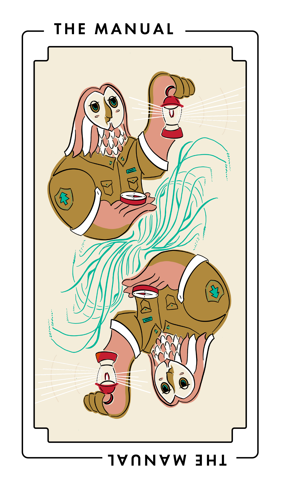

# The Manual

The project type focuses on writing new docs for the people who use your software.
This also includes writing docs that completely replace existing docs.

The Manual is also known as _writing docs_, _rewriting docs_, and _documenting_.
_The Manual_ is most similar to [The Edit](./edit.md), which applies when you’re modifying existing docs in a limited way.
_The Manual_ is often preceded by:

- [The Study](./study.md), to learn what topics would make the greatest impact for your audience
- [The Audit](./audit.md), to find gaps in your current docs or the unsalvageable parts to replace
- [The Prototype](./prototype.md), to test out a new kind of documentation or writing-and-review process

Once you’ve published new docs, _The Manual_ is often followed by revising docs based on what you learned while writing them in the first place ([The Edit](./edit.md)) or translating docs for a wider audience ([The Translation](./translation.md)).

## Audience

This type of project benefits:

<table>
  <thead>
    <tr>
      <th>Audience</th>
      <th>Frequency</th>
    </tr>
  </thead>
  <tbody>
    <tr>
      <td>Users of your software</td>
      <td>Always</td>
    </tr>
    <tr>
      <td>Third-party developers and administrators</td>
      <td>Sometimes</td>
    </tr>
    <tr>
      <td>Contributors to your software and docs</td>
      <td>Rarely</td>
    </tr>
  </tbody>
</table>

## When to do this project

Do this type of project when you need to help your readers learn to complete a task or a set of tasks, understand essential concepts, or get reference information.

Do this project to solve problems such as:

- You have a known use case or user story that is undocumented.
  For example, after conducting some research, you learned that some users wish to deploy your software on Windows, but your docs only cover deployment on Linux.

- You have evidence that users need specific task, concept, or reference material.
  For example, third-party developers using your software’s API often report bugs caused by not understanding the meaning of your software’s error codes.

- You have new types of documents to create.
  For example, you’re shipping an API for your software for the first time and now you need to write API task and reference articles for the first time.

Don’t do this project when:

- You feel the need to tick a box.
  Resist the urge to create a unique document for every widget and menu item or to write a glossary entry for every new word in your user interface.

- You wish to use docs as a substitute for fixing known bugs in your software.
  “Known issues” with complex workarounds tend to be unsatisfying for developers and users alike.

- You made incremental changes to the software, such as modifying the user interface, adding an option or setting, or fixing bugs.
  Consider incorporating the required documentation work, such as writing release notes entries, into the “definition of done” for shipping those changes.

## Tasks and deliverables

You have finished this type of project when you’ve completed tasks such as:

- Audience analysis, such as finding out who’s going to use the software, what motivates them, the things they already know about, and what they might need to learn (sometimes as a project of its own, [The Study](./study.md))
- Identifying document types to be written, such as tasks, concepts, and references
- Writing a high-level documentation plan, enumerating each document to write, noting its audience, topic, type, synopsis, and relationship to other documents (as in a new or modified table of contents)
- Choosing or writing templates for each document type
- Writing a low-level outline for each document to write, noting the audience, headings, and key points for each
- Reviewing outlines
- Writing, reviewing, and revising drafts
- Creating tables, screenshots, and other figures
- User testing (sometimes as a project of its own, [The Study](./study.md))
- Preparing drafts for publication, such as converting to a specific format or entering it into a content management system
- Publishing the docs
- Announcing the changes

You probably won’t do all of these steps.
Choose the ones that make the most sense for your goals, available skills and resources, and timeline.

### Out of scope

Some tasks aren’t part of this project type, such as:

- Redesigning layouts and other presentational matters
- Creating original charts, diagrams, illustrations, graphics, or photography ([The Experiment](./experiment.md))
- Modifying already-written docs to be consistent with the new docs ([The Edit](./edit.md))

Avoid including this work in your project plan.
Break it out into its own project.

## Key people

Technical writers often do this work.
For especially large technical writing projects, a team of technical writers may work with a technical editor, a project manager, or both.

Good candidates for this work often have:

- Domain familiarity but not necessarily expertise.
  For example, a technical writer working on a statistical analysis software package ought to have basic knowledge of statistics, but may not be a statistician themselves. Technical writers often substitute curiosity for expertise.

- Experience with your preferred authoring tools.
  For example, they know how to author docs in your file format or content management system.

Subject matter experts, such as the developers who implement new features, are essential contributors to this work.
They should expect to answer questions, participate in informational interviews, demo functionality, or read docs for technical review.

Others contribute to this work.
In your plan, don’t forget to include:

- Team leadership
- Code and documentation reviewers
- Support roles, such as community managers, foundation leaders, and fiscal and other sponsors (and sponsor staff, such as finance, recruiters, sysadmins, or legal)

## Delay and failure risks

This project type is at most risk from inadequate reviewer capacity.
Other sources of risk are less common.

Risks include:

- Inadequate reviewer capacity.
  First-time reviewers are often surprised by how long it takes to review docs.

- Lack of focus.
  Needlessly coupling writing to other work, such as tool migrations (see also: [The Migration](./migration.md)) or visual redesigns, is a sure way to delay a writing project.

- Lack of incremental feedback.
  Review shorter, lower-fidelity texts, such as docs plans and outlines, to avoid lengthier rounds of review and revision on completed drafts.

- Rework.
  Unbounded rounds of revisions makes it difficult for writers to schedule their working time, provide timely revisions, and maintain consistency across many documents.
  Consider capping the number of revisions for each document, timeboxing revision work, or adopting a publish first, edit later workflow.

- Unclear acceptance criteria.
  Use a style guide to avoid mercurial style demands.
  Before writing begins, decide what constitutes blocking and non-blocking feedback.

- Too many veto points.
  If many reviewers are invited to give feedback, limit how many reviewers may block acceptance.
  Prefer a process that favors non-blocking “approved with optional suggestions” over blocking “changes requested.”

- Key people become unavailable.
  Prioritize time-to-publish over comprehensiveness to hedge against unexpected departures.

## Resources

- [Diátaxis](https://diataxis.fr/)
- [The Good Docs Project](https://www.thegooddocsproject.dev/)
- Write the Docs [Software documentation guide](https://www.writethedocs.org/guide/)
- Example project: The Wikimedia Foundation’s [2024 Google Season of Docs Case Study](https://www.mediawiki.org/wiki/Season_of_Docs/2024/Case_study)
