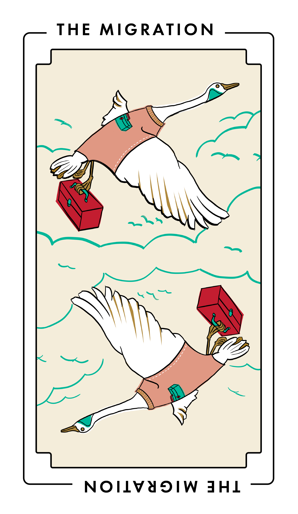

# The Migration

This project type focuses on switching the tools you use to make or deliver docs to your audience, such as adopting a new markup language, static site generator, content management system, or hosting service.

_The Migration_ is also known as _replatforming_, _retooling_, _reformatting_, _porting_, and _upgrading_.
It’s often preceded by [The Audit](./audit.md), to find docs worthy of migration, or [The Study](./study.md), to learn what kinds of migrations might make a difference to your audience or documentation contributors.

Once you’re equipped with a new tool, _The Migration_ is often followed by generating new docs ([The Factory](./factory.md)), improving accessibility or inclusiveness ([The Curb Cut](curb_cut.md)), or internationalization and localization ([The Translation](translation.md)).

## Audience

This type of project benefits:

<table>
  <thead>
    <tr>
      <th>Audience</th>
      <th>Frequency</th>
    </tr>
  </thead>
  <tbody>
    <tr>
      <td>Users of your software</td>
      <td>Sometimes</td>
    </tr>
    <tr>
      <td>Third-party developers and administrators</td>
      <td>Rarely</td>
    </tr>
    <tr>
      <td>Contributors to your software and docs</td>
      <td>Sometimes</td>
    </tr>
  </tbody>
</table>

## When to do this project

Do this type of project when your tools are impairing your documentation contributors’ ability to write docs or to deliver it to your readers.

Do this project to solve problems such as:

- Your docs are siloed into controlled-access tools such as forums, wikis, Google Docs, or Discord.

- Your docs are in a format that contributors don’t like or can’t use.
  For example, the docs were originally created in a proprietary format, but now contributors want to use Markdown.

- Your documentation tools are outside your contributors’ expertise.
  For example, you can’t extend your Ruby static site generator because the contributors mostly know Go.

- Your documentation tools are out of date.
  For example, you’re running an old version of WordPress that’s incompatible with necessary plugins.

Don’t do this project when:

- You (or a vocal documentation contributor) wants to install their favorite tool.
  Some people only have a hammer; don’t let your docs be the nail.

- You want to learn, experiment with, or invent a new documentation tool or other technology.

- You don’t know what docs you need to update or create and how the new tool or tools help do that.

### Tasks and deliverables

You have finished this type of project when you’ve completed tasks such as:

- User research, such as finding out who’s going to use the new documentation tools, what their needs are, their strengths, weaknesses, and expectations
- Technology research, such as finding possible tools or formats, evaluating them, and making recommendations to decisionmakers and stakeholders
- Backing up and archiving existing docs
- Converting formats and moving files
- Testing migrated content
- Deployment in production
- Onboarding documentation contributors to the new tools, through promotion, training, or docs

You probably won’t do all of these steps.
Choose the ones that make the most sense for your goals, available skills and resources, and timeline.

### Out of scope

Some tasks aren’t part of this project type, such as:

- Redesigning layouts and other presentational matters
- Reordering or reorganizing the docs to be migrated ([The Edit](./edit.md), [The Manual](./manual.md))
- Revising or rewriting the docs to be migrated ([The Edit](./edit.md))

Avoid including this work in your project plan.
Break it out into its own project.

## Key people

Technical writers often do this work.
If you need deep customization or your docs are primarily generated, then you might need a documentation engineer or content engineer.

Good candidates for doing this work often have experience with:

- Change management.
  It’s likely that your documentation process will be different after the migration is complete.
  Documentation contributors need help understanding the change, accepting it, and using the new tools.

- Your migration’s target technology, such as the source format, static site generator, or content management system.
  If you use a static site built from plain-text source files held in version control, then seek out a technical writer with experience in “[docs as code](https://www.writethedocs.org/guide/docs-as-code/).”

A good fit for this work probably starts with a spreadsheet, to track materials to be migrated, not their IDE.

Others contribute to this work.
In your plan, don’t forget to include:

- Team leadership
- Code and docs reviewers
- Support roles, such as community managers, foundation leaders, and fiscal and other sponsors (and sponsor staff, such as finance, recruiters, sysadmins, or legal)

## Delay and failure risks

Migration projects are at most risk from problems in change management, scope creep, and time management.
Technical and legal risks are less common.

Risks include:

- Poor change management.
  Conducting user research, to learn what other documentation contributors will love, hate, or tolerate, and active communications with contributors can avoid ugly surprises.

- Lack of focus.
  Needlessly coupling migrations to other work, such as content rewrites or visual redesigns, is the surest way to delay a migration.

- Lack of direction and commitment.
  If you wish to adopt a new tool, someone needs to be able to decide which tool to adopt.
  Using a [responsibility assignment matrix](https://en.wikipedia.org/wiki/Responsibility_assignment_matrix) in your project plan can help clarify decisionmaking.

- Failure to anticipate scale.
  Failure to complete a content inventory (sometimes as a project itself, [The Audit](./audit.md)) can lead to needlessly slow efforts. Don’t be the team that converts 10,000 pages by hand or builds a custom conversion pipeline for 10 pages.

- Legal problems.
  If you’re copying content from source to another, you might need to get permission, ask authors to re-contribute, or create your own original substitutes to replace unlicensable content.

## Resources

- [Static Site Generators - Top Open Source SSGs | Jamstack](https://jamstack.org/generators/)
- [Documentation inventory guide (google/opendocs)](https://github.com/google/opendocs/blob/main/audit/inventory.md#documentation-inventory-guide)
- [Pandoc](https://pandoc.org/)
- [Don’t Fear Migration! How to Successfully Move Docs to a New Tool](https://www.writethedocs.org/videos/portland/2020/don-t-fear-migration-how-to-successfully-move-docs-to-a-new-tool-brooke-wayne/) (video)
- _Example_: [Google Season of Docs 2021 case study for BRL-CAD](https://brlcad.org/wiki/Google_Season_of_Docs/2021/Case_Study)
