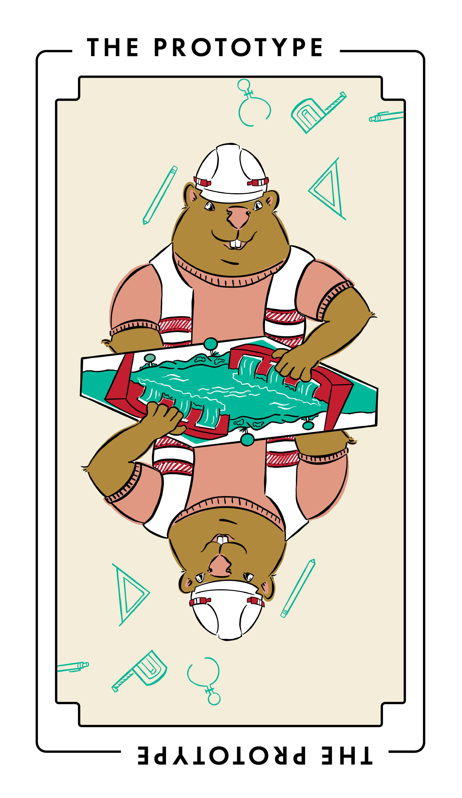

# The Prototype

This project type focuses on finding the practicality and scope of future work, to prepare some larger documentation project.
In other words, it’s any one of the other project types, but in miniature.

_The Prototype_ is also known as a pilot, feasibility, discovery, proof of concept, trial, or exploration project.

_The Prototype_ is mostly closely related to [The Study](./study.md) but with a more action-oriented bent.

_The Prototype_ is often preceded by [The Study](./study.md) or [The Audit](./audit.md), to find what kinds of documentation work may need to be done or how to do it.

_The Prototype_ is often followed by any of the other project types, after they’ve been proven by _The Prototype_’s test run.
 
 
 
 
 

## Audience

This type of project benefits:

<table>
  <thead>
    <tr>
      <th>Audience</th>
      <th>Frequency</th>
    </tr>
  </thead>
  <tbody>
    <tr>
      <td>Users of your software</td>
      <td>Sometimes</td>
    </tr>
    <tr>
      <td>Third-party developers and administrators</td>
      <td>Sometimes</td>
    </tr>
    <tr>
      <td>Contributors to your software and docs</td>
      <td>Always</td>
    </tr>
  </tbody>
</table>

## When to do this project

Do this project when you’re not certain what docs work is plausible, especially for a given timeline or budget, or to narrow a range of options.

Do this project to solve problems such as:

- You have difficulty estimating the duration or cost of a potential documentation project.
  For example, if you wish to edit hundreds of docs (as in [The Edit](./edit.md)), then you might use _The Prototype_ to refine your estimates by test editing a small sample.

- You are unsure about key decisions needed for a potential documentation project.
  For example, if you wish to switch content management systems (as in [The Migration](./migration.md)), then you might use _The Prototype_ to disqualify options by migrating a small sample to multiple content management systems.

- You are unsure about working with a specific writer or other specialist.
  For example, if you wish to use funding to pay a programmer to write code samples, then you might use _The Prototype_ to produce a few examples before committing to a larger effort.

Don’t do this project when you lack consensus for a well-defined full-scale project.
For example, if you have broad alignment but for a single, loudly dissenting stakeholder, don’t use this project to appease the dissenter by substituting a complete project for a partial one.
Instead, consider using your open source project’s governance tools (such as votes) or stakeholder management strategies (such as checkpoints or milestones) to drive forward with a full-scale project.

## Tasks and deliverables

You have finished this type of project when you’ve completed tasks such as:

- Interviewing stakeholders and subject matter experts
- Identifying possible risks to mitigate and actions which might confirm or dismiss those risks
- Completing vertical slices of larger work, such as setting up a content management system and migrating a single doc to it
- Completing horizontal slices of larger work, such as writing rough outlines for a comprehensive documentation set
- Completing random samples of larger work, such as auditing a small sample of a large documentation site
- Reviewing and evaluating the results
- Writing and publishing reports on lessons learned, risks discovered, and likely next steps
- Presenting results to stakeholders
- Writing requirements, requests for proposals (RFPs), statements of work (SOWs), and other documents that support follow-up work

You probably won’t do all of these steps.
Choose the ones that make the most sense for your goals, available skills and resources, and timeline.

### Out of Scope

Some tasks aren’t part of this project type, such as:

- Comprehensive, high-certainty tasks that you would put into a full-scale project—tasks that would not give you new information to plan a follow-up project
- Tasks directly related to completing follow-up work, such as recruiting contributors

Avoid including this work in _The Prototype_ your project plan.
Break it out into its own project.

## Key people

Whoever would do the full-scale version of this project, such as technical writers, programmers, researchers, or other specialists, often do this work.

Good candidates for this work often have experience in the work you wish to complete (see any of the other project types for details).
But _The Prototype_ is also a way to test whether a contributor with little experience can make meaningful progress on it.

A good fit for this work has bravery.
They’ll look at the possible work and gravitate towards the most uncertain, riskiest steps first, to reduce the risks of a bigger follow-up effort.

Others contribute to this work. In your plan, don’t forget to include:

- Team leadership
- Code and docs reviewers
- Support roles, such as community managers, foundation leaders, and fiscal and other sponsors (and sponsor staff, such as finance, recruiters, sysadmins, or legal)

## Delay and failure risks

This project type is at most risk from unclear limits and risk aversion.
Other sources of risk are less common.

Risks include:

- Unclear limits.
  _The Prototype_ without a strict scope, timebox, or budget is a full-scale project with incomplete planning.
  It’s likely to inherit all of the risks of a regular project type with none of its mitigations.

- Risk aversion.
  This type of project can fail to support future work when contributors focus on tasks that are perceived as safe or certain, while avoiding or deferring tasks that have unknowns.
  If _The Prototype_ is to reduce the risk of future work, it must allow for the possibility of failed, incomplete, or discarded effort.

- Poor sampling.
  If you’re using _The Prototype_ to refine estimates, then make sure you take a broad or random sample of the possible future work.

- Scope creep.
  Because _The Prototype_ is associated with minimal planning and greater uncertainty, it’s vulnerable to adding more tasks without an understood risk management payoff.

## Resources

_The Prototype_ is a meta project.
See the resources for the specific project type you’re trying to learn about.
