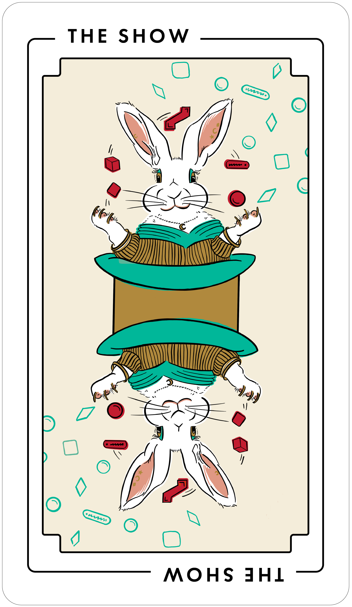

# The Show

This project type focuses on creating audio and visual documentation, such as screencasts.
It may also include work such as livestreams, podcasts, and other audiovisual formats, if they’re intended to complement or supplement your docs.

_The Show_ is also known by its most common artifacts: voiceovers, animation, screencasts, and live-action video.

_The Show_ is most closely related to [The Invention](#), to produce assets that can be used in animations and video, such as diagrams and illustrations.

_The Show_ is often preceded by [The Manual](./manual.md), to make procedural docs that are the basis for video scripts.

_The Show_ is sometimes difficult to estimate for size or duration.
Consider testing the work with [The Prototype](./prototype.md).

_The Show_ is often followed by [The Curb Cut](#), to make audio and video accessible (if previously forgotten).

## Audience

This type of project benefits:

<table>
  <thead>
    <tr>
      <th>Audience</th>
      <th>Frequency</th>
    </tr>
  </thead>
  <tbody>
    <tr>
      <td>Users of your software</td>
      <td>Always</td>
    </tr>
    <tr>
      <td>Third-party developers and administrators</td>
      <td>Sometimes</td>
    </tr>
    <tr>
      <td>Contributors to your software and docs</td>
      <td>Rarely</td>
    </tr>
  </tbody>
</table>

## When to do this project

Do this project to solve problems such as:

- You can’t reach audiences that are strongly bound to social video platforms.
  For example, your users rely heavily on YouTube or TikTok videos to learn about your open source software or its problem domain.

- You want to reach your audience away from their desks (if they have one at all).
  For example, you want to help cement ideas with your audience while they’re driving a car or running on a treadmill.

- Your open source software or its problem domain is difficult to explain in ordinary text or static images.
  For example, your software is itself a tool for making animations and sound.

## Tasks and deliverables

You have finished this type of project when you’ve completed tasks such as:

- Audience analysis, such as finding out who’s going to listen or watch, what motivates them, the things they already know about, and what they might need to learn (sometimes as a project of its own, [The Study](./study.md))
- Writing a high-level production plan, enumerating each audiovisual item to produce, noting its audience, topic, type, synopsis, relationship to other materials, required facilities and equipment (such as cameras, lights, or a quiet room to record audio in), and required contributors (such as people to appear on screen)
- Writing a low-level outline for each audiovisual item to produce, noting the audience and key points for each
- Writing scripts (or looser texts, such as talking points) and storyboarding
- Reviewing scripts and storyboards
- Recording audio
- Recording video
- Animating and compositing
- Editing (that is, assembling or removing clips of audio and video)
- Reviewing completed audio and video
- Writing (or generating and editing) transcripts, subtitles, and audio descriptions
- Preparing media for publication, such as converting to a specific format or uploading to a platform
- Publishing to your docs site, social platform, or other venue
- Announcing the results

You probably won’t do all of these steps.
Choose the ones that make the most sense for your goals, available skills and resources, and timeline.

### Out of Scope

Some tasks aren’t part of this project type, such as:

- Writing the docs that underlie this work ([The Manual](./manual.md))
- Creating code samples or demos that underlie this work ([The Widget](./widget.md))

Avoid including this work in _The Show_.
Break it out into its own project.

## Key people

Specialist audio and video producers often do this work.
Others, such as technical writers, trainers, and instructional designers, sometimes produce video docs (such as screencasts) or video courses as part of their practice.

Good candidates for this work often have experience with audio and video production and know how to answer accessibility questions, such as how to include subtitles or publish transcripts.

A good fit for this work is patient and detailed.
By its nature, audio and video as a medium takes a lot of time to assemble and edit.
A successful contributor breaks down the project into its many pieces and works through them, one by one.

Others contribute to this work.
In your plan, don’t forget to include:

- Team leadership
- Code and docs reviewers
- Support roles, such as community managers, foundation leaders, and fiscal and other sponsors (and sponsor staff, such as finance, recruiters, sysadmins, or legal)

## Delay and failure risks

This project type is at most risk from lack of incremental feedback.
Other sources of risk are less common.

Risks include:

- Lack of incremental feedback.
  Failing to review scripts, storyboards, demos, and other incremental work products vastly increases the risk of time-consuming rework.

- Absolute duration.
  Audio and video materials take orders of magnitude longer to complete than text of similar quality and complexity.
  For example, it’s not unusual to budget a full workday (or more) for every minute of screencast video.
  Allocate abundant time for production.

- Stakeholder skepticism.
  It’s common for some stakeholders to believe that their own learning preferences, such as preferring text over video, are universal.
  Don’t skip audience analysis, since this may be the only way to conclusively justify or rule out this project type.

- Key people become unavailable.
  This project type often hinges on a few key contributors.
  Prioritize time-to-publish to hedge against unexpected departures.

## Resources

- [So you want to make videos? — Write the Docs](https://www.writethedocs.org/videos/prague/2018/so-you-want-to-make-videos-sarah-ley-hamilton/) \[video\]
- [JoseDeFreitas/awesome-youtubers](https://github.com/JoseDeFreitas/awesome-youtubers#readme)
