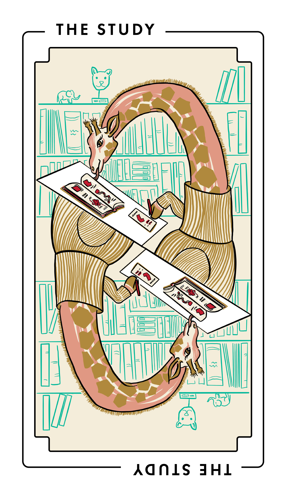

# The Study

This project type focuses on learning more about your users, how they use your software and docs, and what options are available to you to improve your docs.

_The Study_ is also known as research, user research, or audience analysis.
It’s also known by the names of its most well-known methods: SWOT analysis, interviews, surveys, focus groups, usability tests, card sorting, A/B tests, analytics and telemetry, and many others.

_The Study_ often precedes all other docs project types, when it helps you decide what to do next.
_The Study_ often follows all other docs project types, when it helps you evaluate what you’ve already done.
 
 
 
 
 
 

## Audience

This type of project benefits:

<table>
  <thead>
    <tr>
      <th>Audience</th>
      <th>Frequency</th>
    </tr>
  </thead>
  <tbody>
    <tr>
      <td>Users of your software</td>
      <td>Rarely</td>
    </tr>
    <tr>
      <td>Third-party developers and administrators</td>
      <td>Rarely</td>
    </tr>
    <tr>
      <td>Contributors to your software and docs</td>
      <td>Always</td>
    </tr>
  </tbody>
</table>

## When to do this project

Do this project when you need to decide what documentation work to do next or to evaluate documentation work you’ve already completed.

Do this project to solve problems such as:

- You don’t know who your users or contributors are.
- You don’t know what users need from your software or docs.
- You don’t know what options are available for improving your docs.
- You don’t know how to decide between many options for improving your docs.
- You don’t know whether, how, or why your previous docs work was successful.

Don’t do this project when you don’t like the answers to your previous research questions.

## Tasks and deliverables

You have finished this type of project when you’ve completed tasks such as:

- Formulating research questions, to decide what you wish to learn
- Reviewing existing literature and prior art
- Posing hypotheses, to make falsifiable predictions
- Choosing qualitative research methods, if appropriate, such as interviews, focus groups, or user testing
- Choosing quantitative research methods, if appropriate, such as surveys, A/B tests, or analytics
- Recruiting research participants
- Collecting data by applying your chosen research methods
- Reviewing and evaluating the data, comparing it against your hypotheses
- Synthesizing planning tools, such as user personas, user stories, and journey maps
- Making recommendations
- Writing and publishing reports
- Presenting results to stakeholders

You probably won’t do all of these steps.
Choose the ones that make the most sense for your goals, available skills and resources, and timeline.

### Out of scope

Avoid including acting on your research results in your project plan.
Break it out into its own project.

## Key people

Researchers, such as user researchers or UX researchers, often do this work.

Other experts, such as tech writers and designers, include research as part of their practice.
Sometimes it’s helpful to work with someone who you expect to be involved in follow-up work, to minimize knowledge transfer costs.

Good candidates for this work often have:

- Familiarity with open source software practices and culture.
  Open source has resource and cultural constraints that are distinct from corporate or academic research.

- Familiarity with methods that suit you and your collaborators.
  Researchers vary widely in preferred approaches, especially when it comes to overall formality.

Research participants, such as interviewees and survey respondents, are critical to the success of a research project.
Don’t forget participant recruitment in your research plan, especially if you wish to include participants from outside your existing user base.

Others contribute to this work. In your plan, don’t forget to include:

- Team leadership
- Code and documentation reviewers
- Support roles, such as community managers, foundation leaders, and fiscal and other sponsors (and sponsor staff, such as finance, recruiters, sysadmins, or legal)

## Delay and failure risks

This project type is at most risk from poor methods or lack of participation.
Other sources of risk, such as poor research ethics, are less common.

Risks include:

- Poor methods.
  It’s common to reach for methods that are familiar, such as running a survey, even if they’re not the best tool for answering a research question.

- Lack of participation.
  Certain methods, such as surveys and A/B tests, may only yield meaningful results with a large number of participants.
  Consider alternative methods, such as interviews, which can yield useful results even with few participants.

- Motivated research and confirmation bias.
  Avoid a research plan intended to produce evidence to support actions you already wish to take.
  If you think falsifying your hypothesis would be a bad outcome, this is a sign your research plan is not asking genuine questions.

- Privacy and legal.
  Collecting and retaining information from research participants may present legal obligations for you and privacy risks to participants.
  Know the data protection regulations (such as [GDPR](https://en.wikipedia.org/wiki/General_Data_Protection_Regulation) or [CCPA](https://oag.ca.gov/privacy/ccpa)) and best practices that apply to your research methods.

- Poor research ethics.
  Narrowly, sponsors of this work may require an institutional review board or ethics committee to approve your plan before proceeding; unethical methods may be rejected.
  More broadly, research participants must have the opportunity to give meaningfully informed consent to your methods.
  Failure to consider ethics questions in advance may result in harm to research participants and damage to your software project’s reputation.

- Key people become unavailable.
  Prioritize time-to-publish over comprehensiveness to hedge against unexpected departures.

## Resources

- [Just Enough Research](https://www.mulebooks.com/just-enough-research) by Erika Hall
- 18F User Experience Guide’s [Plan](https://18f.org/guides/ux-guide/research/plan/)
- UK Government Digital Service [User research - Service Manual](https://www.gov.uk/service-manual/user-research)
- Nielsen Norman Group’s [UX Research Cheat Sheet](https://www.nngroup.com/articles/ux-research-cheat-sheet/)
